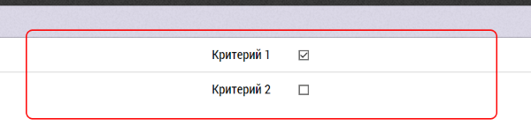

## Итоги визита к ОЛ

Интерфейс занесения итогов визита к субъекту (ОЛ) содержит, как [общие для всех итогов визита](rep-visits.html) блоки, так и отличающиеся.

В отличии от итогов визита, например к врачу, ОЛ не имеют заранее жестко заданных в программе критериев.

Их должен задать администратор при первоначальной настройке базы.

Например критериями могут быть:
- знание препарата
- коммуникабельность
- умение заинтересовать врача

Пользователь видит эти критерии, и может проставить или не проставить галочку напротив каждого критерия.

Если критерии не заданы, то при переходе к окну заполнения итогов визита к ОЛ, будет следующая надпись: 

`Не заданы критерии оценки. Критерии задаются на странице управления данными, вкладка: "Списки"`

>Список критериев задается администратором, в разделе "База Данных" -> "Списки" -> "Критерии: OL".
