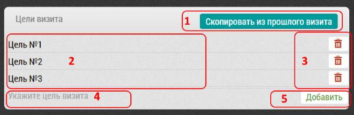

## Цели визита

К любому визиту могут быть добавлены цели.
Это просто строки, пользователь сам решает что указать в качестве цели.

Цели можно добавить при добавлении визита в план - в 
[интерфейсе календаря](rep-add-target.md), 
или уже непосредственно при занесении итогов визита.

Блок "Цели визита" состоит из:

  1. Кнопки "Скопировать из прошлого визита" - для случаев повторного визита и повторяющихся целей
  2. Список текущих целей визита
  3. Кнопки "Корзина" - для удаления какой-либо цели из списка
  4. Поле для добавления новой цели. 
  При вводе туда какой либо информации появляется кнопка [5]
  для добавления цели к списку.
