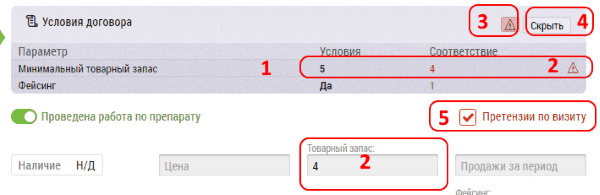

# Претензионный лист

Претензионный лист - документ который оформляется при занесении итогов визита в аптеку с которой заключен [договор](database-object-contract.md).

На странице редактирования итогов визита пометка о наличии договора выводится в списке препаратов, показывая тем самым для какого именно продукта имеется активный договор.

- `1` есть договор, претензий нет, `2` есть договор претензии есть, `3` договора по препарату нет
- `4` договор, по кнопке "Показать" можно увидеть условия договора
- `5` галочка "Претензии по визиту", ее можно поставить независимо от условий договора. Пояснения о претензии следует указывать в поле “Комментарий по препарату”

В форме итогов визита такого препарата выводится блок “Условия договора”, в котором можно увидеть все необходимые параметры договора:

Для этого нужно нажать на кнопку “Показать” `4`

- При заполнении визита, указанные данные сопоставляются с условиями договора `1` 
- В случае несоответствия `2` отображается высвечивается значок предупреждения `3`
- И проставляется галочка "Претензии по визиту" `5`

Чтобы скрыть условия договора нажмите на кнопку "Скрыть" `4`
