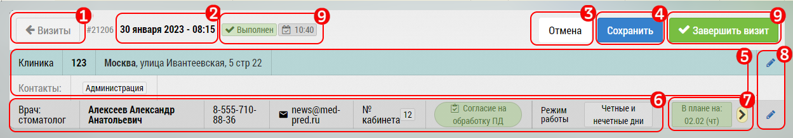

## Осуществление визита и занесение его итогов. Откуда можно открыть страницу визита

Визит и занесение итогов - одна из важнейших задач пользователя.
Закрывая визит пользователя вносит туда данные, 
различающиеся в зависимости от типа визита.

Перейти к закрытию визита можно из подробного 
или краткого плана - ткнув на строку визита.

Визиты могут быть:

  - к субъекту ([врачу](rep-visits-subject.md) или [ОЛ](rep-visits-ol.md))
  - на [объект](rep-visits-object.md) (аптека)
  - [двойные](rep-visits-double.md) (когда менеджер ходит с сотрудником или проверяет его постфактум)
  - [невизит](rep-visits-novisit.md) (визит-эквивалент), в том числе привязанные к объекту или субъекту

У визита могут быть проставлены цели.

Визит может быть геоверифицирован.

К визиту могут быть [добавлены фотографии](rep-visits-foto.md).

Типичный интерфейс работы с визитом выглядит так (поля различаются в зависимости от типа визита):

  1. Общая информация о визите
  2. Поля специфичные для этого типа визита - в данном случае визит к врачу
  3. Блок для [добавления фото](rep-visits-foto.md), комментария к визиту, причины несостоявщегося визита
  4. Блок с [целями визита](rep-visits-target.md)

Блок общей информации о визите состоит из:
  1. Кнопка перехода к визитам в подробном плане
  2. Дата и время визита
  3. Кнопка отмены - закрыть окно заполнения визита - **это не отмена визита**
  4. Кнопка сохранения визита.
  Если минимально необходимый набор полей заполнен, 
  то визит получает отметку 
  5. Информация об объекте визита
  6. Информация об субъекте визита
  7. Кнопки перехода к редактированию объекта/субъекта
  8. Кнопка для добавления в план - для повторного визита прямо из итогов текущего,
  тут же отображается дата следующего или предыдущего визита
  
  
  **Кнопка сохранения визита, закрывает визит, 
     после нажатия на нее данные визита будут записаны,
     некоторые данные нельзя будет изменить потом,
    некоторые типы визита имеют минимальные данные нужные для закрытия**
