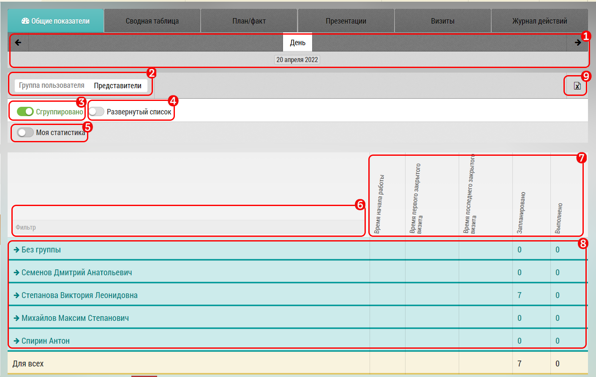

# Отчет по общим показателям

Отчет позволяет руководителю быстро получить сводку о сотрудниках: по всем, в разрезе группы, или конкретному сотруднику за 1 день

Отчет находится: Отчеты - Общие показатели

Интерфейс отчета:

1. Выбор даты (по умолчанию текущая дата)

2. Выбор группы 

3. Группировка - разгруппировка отчета 

4. При нажатом переключателе `3` можно развернуть список

5. Посмотреть собственную статистику

6. Текстовый поиск по фамилии

7. Данные по которым формируется отчет

 * Время начала работы
 * Время первого закрытого визита
 * Время последнего закрытого визита
 * Запланировано визитов
 * Выполнено визитов

8. Таблица данных. Нажимая на руководителя группы, можно увидеть список сотрудников и их данные, состоящие в его группе

9. Выгрузить данные в  формате xls

[Посмотреть видео "Отчет по общим показателям" ](https://storage.yandexcloud.net/support-files/video/report-general-indicators.mp4)
 