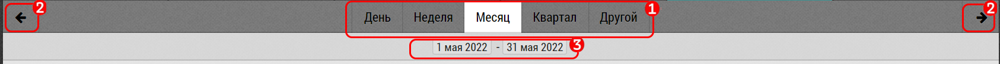
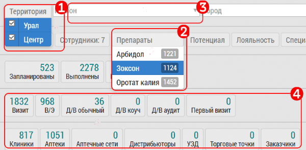

## Статистика. Выбор периода и фильтры. Типы фильтров, множественный выбор

В статистике активно используются различныке фильтры.
Это прежде всего фильтр по дате и фильтры по препаратам, менеджерам, сотрудникам, географические фильтры.

Для фильтрации по дате используется:

1. Выбор текущей недели, месяца, квартала
2. Переход к следующей-предыдущей неделе, месяцу, кварталу
3. Установка произвольного периода и отражение текущего выбранного

Другие фильтры могут быть:

- С мультивыбором из списка [1]. По нажатию на фильтр отображается список с галочками, можно выбрать произвольное сочетание параметров
- С выбором из списка [2]. По нажатию выбор одного элемента. Цифры справа от элемента - количество визитов подходящих под значение
- С поиском и дополнением [3]. По нажатию нужно ввести несколько букв, для поиска и подстановки нужного значения
- Фильтр типа кнопка [4]. Нажатие включает фильтр, повторное нажатие отключает
