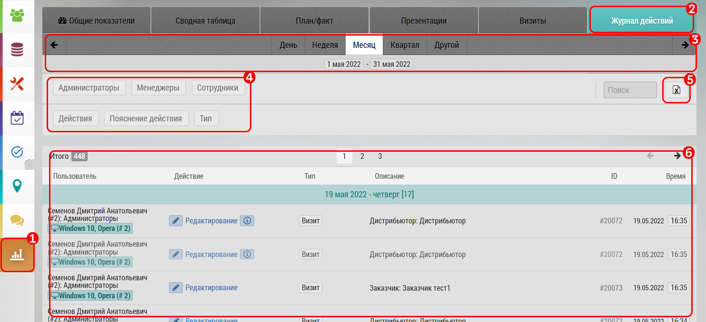

## Журнал действий. Описание, интерфейс, возможности

Журнал действий позволяет просматривать действия пользователей в программе.
Доступен только менеджерам (просмотр своих пользователей) и администраторам (просмотр всех).

В интерфейсе журнала действий:

- Выбрана вкладка "Журнал действий" `1`
- Фильтр по дате `2`
- Фильтр по сотрудникам - можно посмотреть информацию по отдельному сотруднику
- Поле с логом действий:

  - Сотрудник
  - Действие
  - Объект действия (например при редактировании врача это врач)
  - Дата действия с указанием давности
