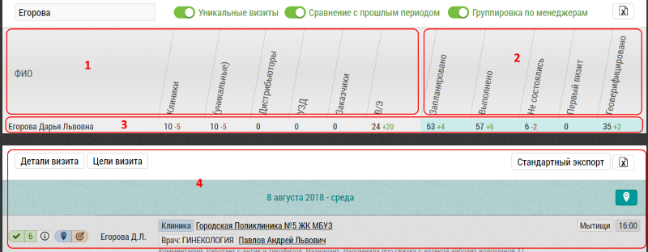

# Общая сводная таблица. Описание некоторых колонок. Экспорт

В общей сводной таблице предоставлено общее количество визитов в разрезе менеджеров и объектов/субъектов визита.

Интерфейс сводной таблицы:

- Колонки `1`, по типам визита:

  - Клиники
  - Уникальные
  - Дистр, УЗД, Заказчики
  - ВЭ
  
- Колонки `2`, по результатам визита:

  - Запланированы
  - Выполнены
  - Не состоялись
  - Первый визит
  - Геоверифицированные
  
В строке `3` с результатами визита соответственно выводится количество визитов по каждой колонке.
Также выводится изменение относительно предыдущего периода.

Строка кликабельна - при нажатии на любую ячейку в строке `3` в поле `4` подгружаются визиты отфильтрованные по ячейке.
