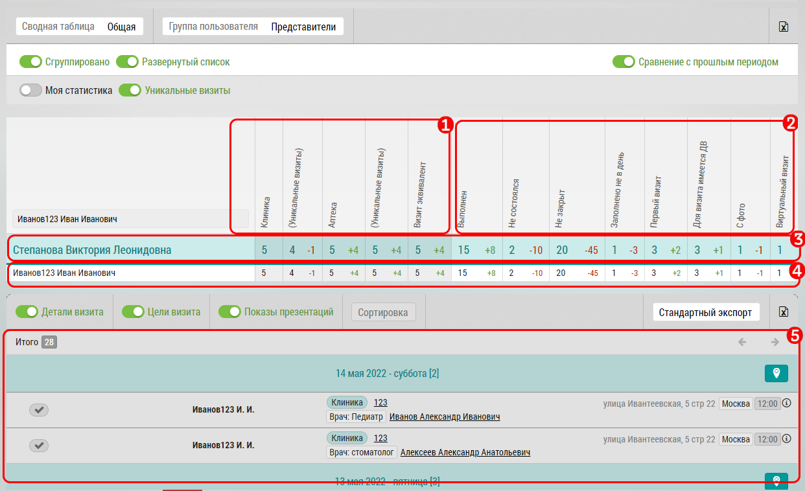

# Общая сводная таблица. Описание некоторых колонок. Экспорт

В общей сводной таблице предоставлено общее количество визитов в разрезе менеджеров и объектов/субъектов визита.

Интерфейс сводной таблицы:

- Колонки `1`, по типам визита:

  - Клиники
  - Уникальные
  - Аптеки
  - Уникальные
  - ВЭ
   
   В зависимости от совершенных визитов могут так же быть  - Дистрибьютеры, УЗД, Заказчики и др.
  
- Колонки `2`, по результатам визита:
  - Выполнены
  - Не состоялись
  - Не закрыт
  - Заполнено не в день
  - Первый визит
  - Для визитов имеется ДВ
  - С фото
  - Виртуальный визит
  
  Так же при наличии геоверифицированных объектов появится колонка:
  - Гео-верифицированные
  
В строке `3` с результатами визита соответственно выводится количество визитов по каждой колонке по всей группе менеджера.
Также выводится изменение относительно предыдущего периода.

 В строке `4` с результатами визита выводится количество визитов по каждой колонке по выбранному сотруднику

Строка кликабельна - при нажатии на любую ячейку в строке `3` в поле `5` подгружаются визиты отфильтрованные по ячейке.
