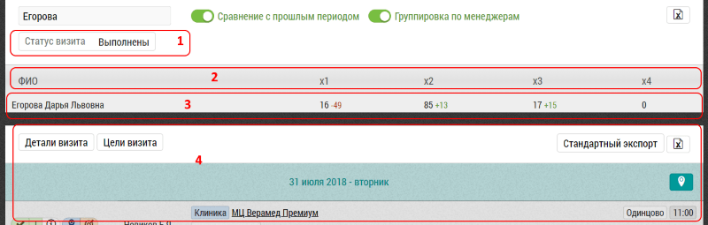

## Сводная таблица - частота визитов

Данная таблица позволяет оценить количество повторных визитов за выбранный период.

В сводной таблице по частоте визитов:

 

- Фильтр [1] позволяет отображать только выполненные или несостоявшиеся визиты

- Колонки [2], количество визитов в объект/субъект за выбранный период:
  - x1, по одному визиту
  - x2, по два визита
  - x3, по три визита
  - ...
  
В строке [3] с результатами визита показано число объектов и субъектов в которые было совершено такое количество визитов.
Также выводится изменение относительно предыдущего периода.

Строка кликабельна - при нажатии на любую ячейку в строке [3] в поле [4] подгружаются визиты отфильтрованные по ячейке.

К примеру "Егорова Дарья" выполнила по три (x3) визитов в каждый из 17-х объектов визита (всего 51 визит).

При этом визиты к разным врачам в одной клинике считаются как отдельные.
