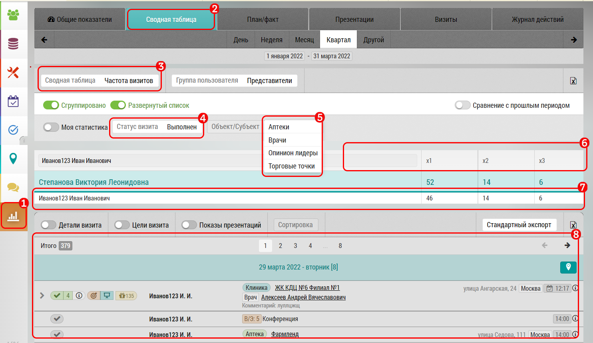

# Сводная таблица - частота визитов

Данная таблица позволяет оценить количество повторных визитов за выбранный период.

В сводной таблице по частоте визитов:

 

`1` Кнопка перехода к отчетам

`2` Выбор отчета "Сводная таблица"

`3` Выбор отчета "Сводная таблица по частоте визитов"

`4` Фильтр позволяет отображать только выполненные, незакрытые или несостоявшиеся визиты

`5` Фильтр позволяет отображать только выборку
по объекту или субъекту

 `6`, Колонки количества визитов в объект/субъект за выбранный период:
  - x1, по одному визиту
  - x2, по два визита
  - x3, по три визита
  - ...
  
В строке `7` с результатами визита показано число объектов и субъектов в которые было совершено такое количество визитов.
Также выводится изменение относительно предыдущего периода.

Строка кликабельна - при нажатии на любую ячейку в строке `7` в поле `8` подгружаются визиты отфильтрованные по ячейке.

К примеру "Иванов" выполнил по три (x3) визитов в каждый из 6-ти объектов визита (всего 18 визитов).

При этом визиты к разным врачам в одной клинике считаются как отдельные.
