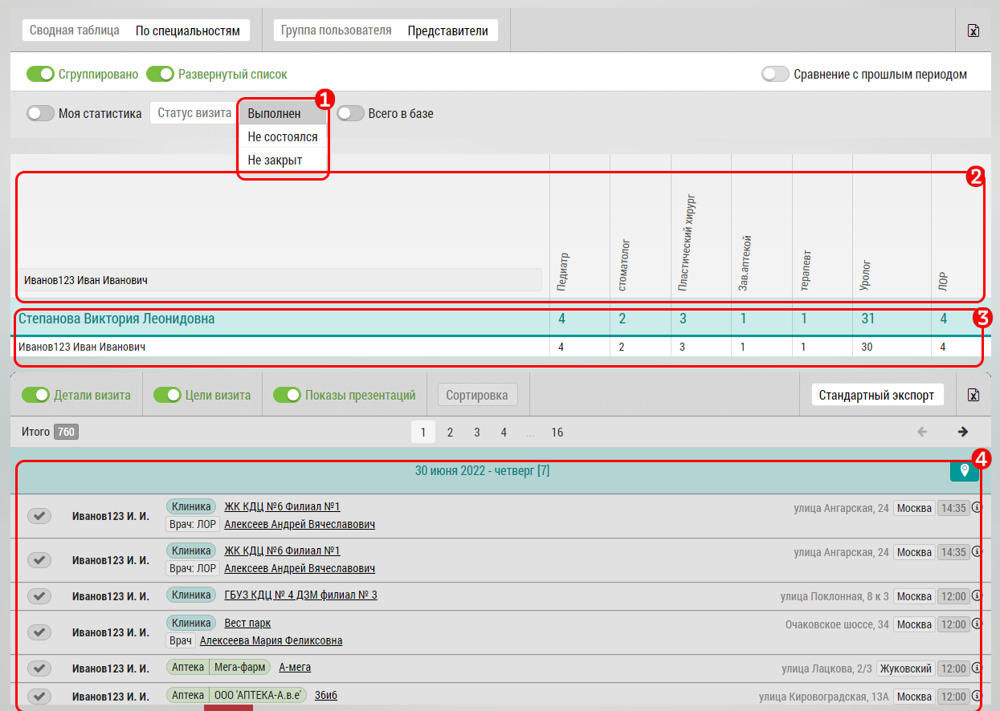

## По специальности. Описание

Сводная таблица по специальности предназначена для получения общей статистики по визитам в разрезе специальностей субъектов (врачей).

В интерфейсе сводной таблицы по специальностям: 

- Фильтр `1` позволяет отображать только выполненные или несостоявшиеся визиты

- Колонки `2`, по специальностям (список зависит от настроек программы):
  - Фармация
  - Педиатр	
  - Окулист
  - ...
  
В строке `3` с результатами визита соответственно выводится количество визитов по каждой колонке.
Также выводится изменение относительно предыдущего периода.

Строка кликабельна - при нажатии на любую ячейку в строке `3` в поле `4` подгружаются визиты отфильтрованные по ячейке.
