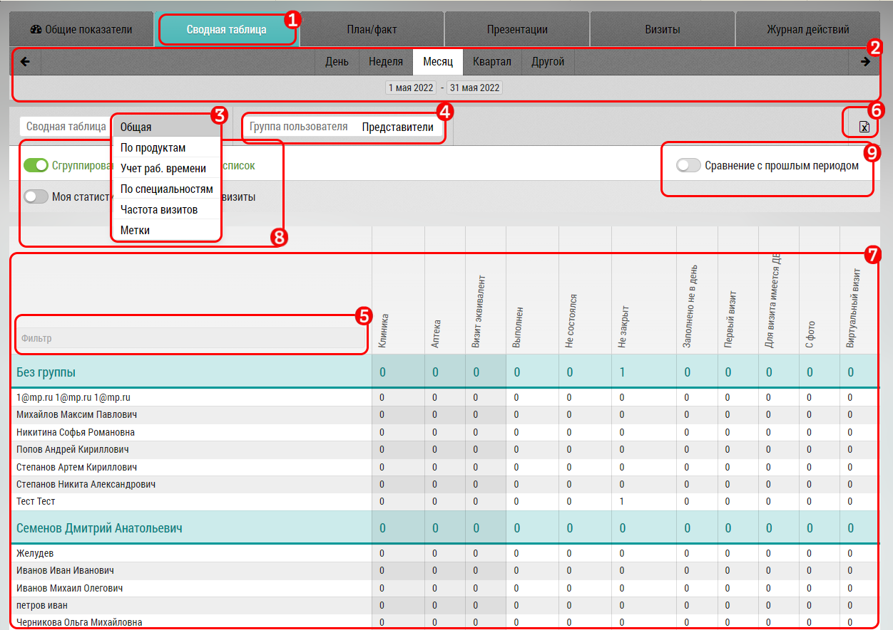

# Сводная таблица. Описание, интерфейс, возможности

Сводная таблица предназначена для получения сводной информации о количестве визитов.
Предоставляет несколько типов отчетов:

  - [Общая](reports-summary-common.html)
  - [По специальности](reports-summary-speciality.html)
  - [Частота запросов](reports-summary-frequency.html)

В интерфейсе сводной таблицы: 

- выбор общей сводной таблицы `1`
- [выбор даты](reports-filters.html) `2`
- выбор типа отчета `3`
- выбор группы пользователя по которым собираются данные `4`
- фильтр по фио `5`
- кнопка экспорта `6`
- блок с данными отчета `7` с разбивкой по пользователям, менеджерам и итоговым результатом

Переключатели `8` зависят от выбранного типа отчета и типа пользователя и изменяют выводимые данные
- "Уникальные визиты" - добавляет в отчет колонку с "Уникальными Визитами"

> Уникальные визиты - это визиты в один объект  или к одному субъекту 1 раз за период. 
> Если пользователь сходил за период в аптеку 2 раза - то в уникальные будет зачтен только первый, т.е. 1 раз.
- "Сгруппировано" - группирует пользователей по менеджеру - добавляет строки с информацией о группе
- "Моя статистика" - Переключатель для перехода к собственной статистике

- "Сравнение с прошлыми визитами" - добавляет цифры относительно прошлого периода - плюс или минус `9`
