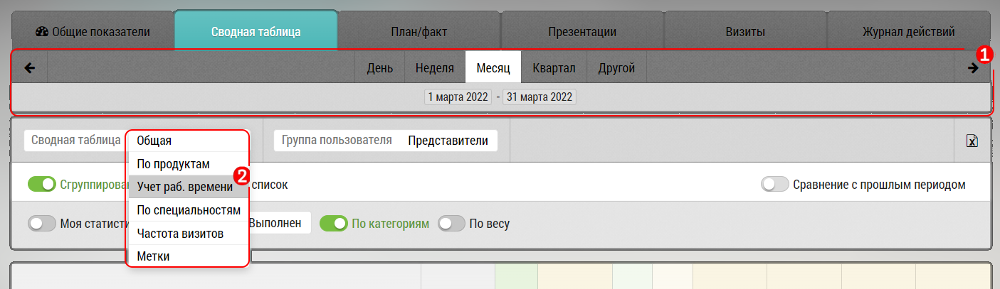
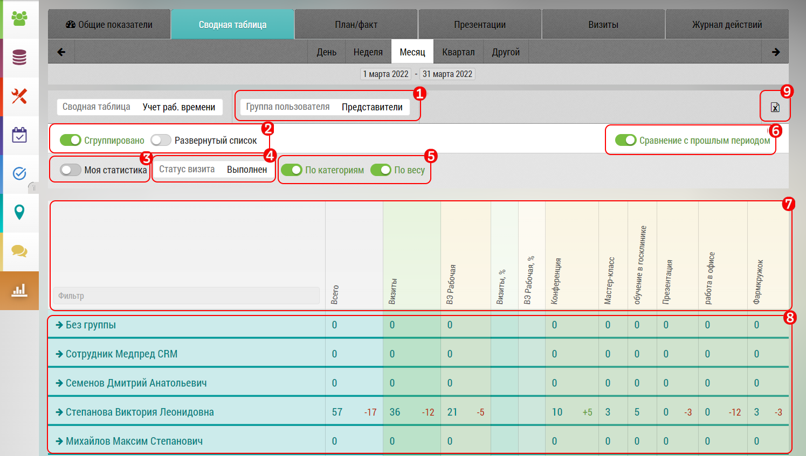
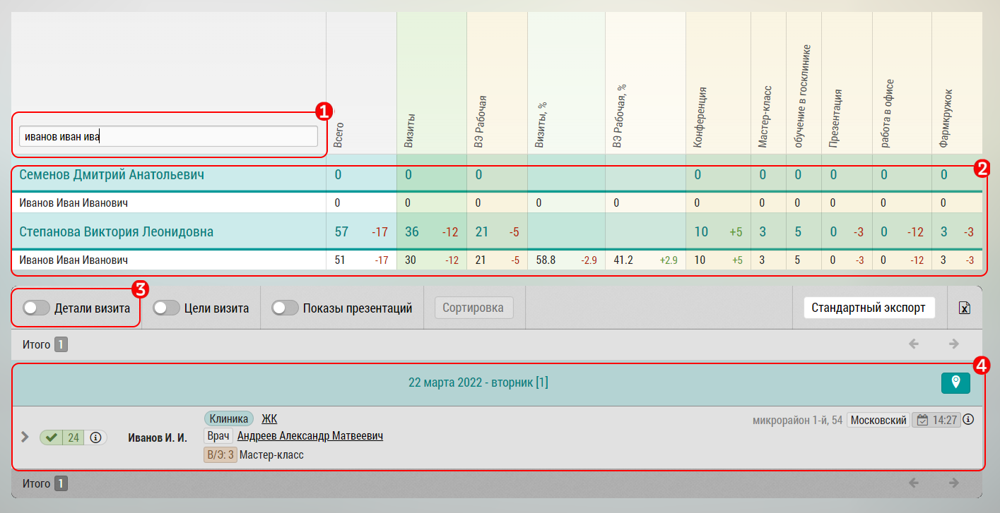

Отчет находится в разделе Отчеты – Сводная таблица – Выбор «Учет рабочего времени»
 
Выберите период (день, неделю, месяц, квартал или другой)
Нажмите на кнопку Сводная таблица, и в выпадающем списке выберите отчет по учету рабочего времени

 **Формирование отчета учета рабочего времени по группам.**

Параметры для формирования отчета:

1. Выбор группы пользователей
2. Переключатель Сгруппировано и Развернутый список  - группирует или раскрывает данные в поле `8`
3. Переключатель для перехода к собственной статистике
4. Выбор статуса визитов
5. Переключатель  по категориям и по весу –  переключает данные день/вес в полях `7` и `8`
6. Сравнение с прошлым периодом
7. Фильтр по ФИО, названия столбцов
8. Данные отчета в таблице
9. Выгрузка отчета с заданными параметрами в XLS

> Все активности считаются в днях. В заголовке таблицы указаны группа активностей В/Э (согласно группировке по Категориям в Списках) и % рабочей и нерабочей активности. 

> Рабочая/нерабочая активность уже проставлена в каждой категории активности.

**Отчет учета рабочего времени конкретного сотрудника**

Сформируйте отчет по учету рабочего времени по группе. В поле «Фильтр» вбейте ФИО сотрудника

 
1. Фильтр по ФИО
2. Таблица рабочей активности
3. Переключение на подробные детали визита
4. Информация по конкретному визиту ( Выберите в блоке 2 конкретный визит)

Кнопкой «Экспорт» можно выгрузить данные по сотруднику в XLS
