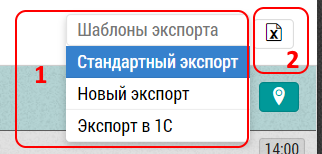

## Экспорт визитов. Варианты экспорта. Детали визита

Экспорт визитов предназначен для выгрузки информации о визитной активности в формат excel или какой нибудь другой.

Экспорт производится по текущим установкам фильтров.

На текущий момент шаблонов экспорта 3:

- Стандартный экспорт
- Новый экспорт
- Экспорт в 1с

Для экспорта визитов: 

- выберите нужный вам шаблон экспорта [1]
- нажмите кнопку [2]

Вы получите стандартный xlsx или другой файл - в зависимости от шаблона.
В выгрузку попадают основные параметры визитов, такие как пользователь, дата, время, место, цели визитов.

Если активна кнопка ["Детали визитов"](reports-visits-visit.md) [1], то в выгрузку попадут детали визита, и на каждый препарат будет сформировано по отдельной строке.
Эти строки будут иметь одинаковый "id".
Т.е. например если во время визита проводилась работа по 3-м препаратам, то в отчете будет не одна строка а три.
И данные относящиеся к визиту в целом в этих трех строках будут одинаковыми.
