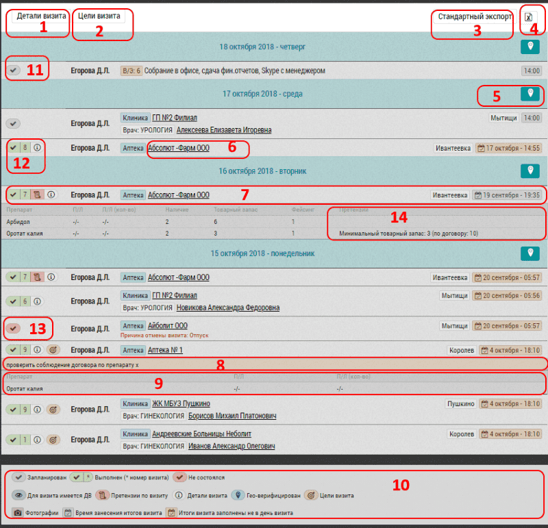

## Описание блока с визитами. Обозначения. Детали и Цели визита

Блок с визитами - блок в котором выводиться подробная информация о визитах.

Строки визита содержат основную информацию о визите:

- запланирован, состоялся или нет
- пользователь, тип визита, объект/субъект визита
- география, дата, время визита
- цели и итоги визита

Строка состоит из:

- кнопок "Детали визита" `1`  и "Цели визита" `2` - которые служат для раскрытия/скрытия деталей и целей всех визитов
- кнопка "Стандартный экспорт" `3` предназначена для выбора шаблона экспорта
- кнопка "Экспорт" предназначена для [экспорта в excel или другой формат](reports-visits-export.html)
- кнопка "Геолокация" `5` предназначена для просмотра визитов дня на карте
- название объекта или субъекта предназначено для перехода к просмотру/редактированию этого объекта/субъекта
- строка визита `7` содержит основную информацию о визите. 
По нажатию на строку раскрывается информация о целях визита `8` и итогах визита `9`
- расшифровка обозначений иконок `10` в том числе:

   - визит запланирован `11`
   - состоялся `12` причем уже в 4-й раз
   - не состоялся `13` по причине "Болезнь" 
