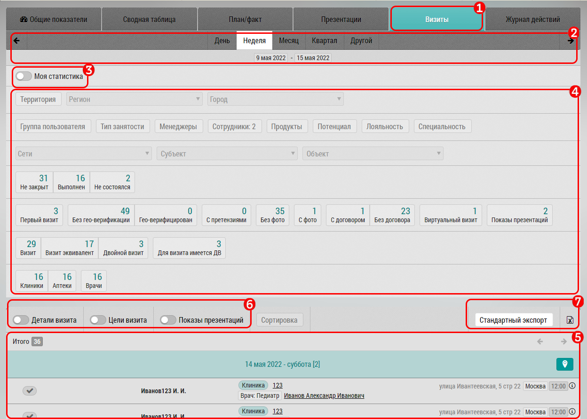

## Визиты. Описание, интерфейс, возможности (переключатель "Моя статистика")

Отчет "Визиты" предназначен для просмотра визитов в различных срезах и за различный период.

В отчете "Визиты":

1. Блок выбора текущего отчета (в примере "Визиты")
2. Блок [фильтрации по дате](reports-filters.md)
3. Переключатель "Моя статистика"
4. Блок [фильтров по различным параметрам](reports-filters.md)
5. Блок отображения результатов запроса - сами [визиты](reports-visits-visit.md)

Переключатель "Моя статистика" - предназначен для менеджеров или администраторов.
Он позволяет переключаться между статистикой подчиненных (в случае администратора - всех) пользователей и статистикой самого менеджера.
