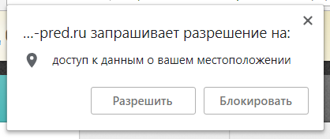
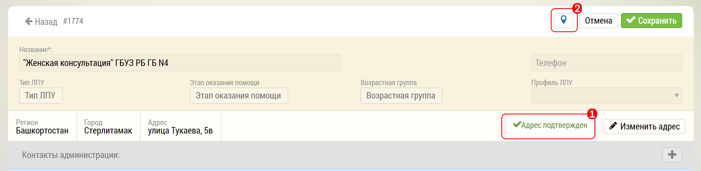
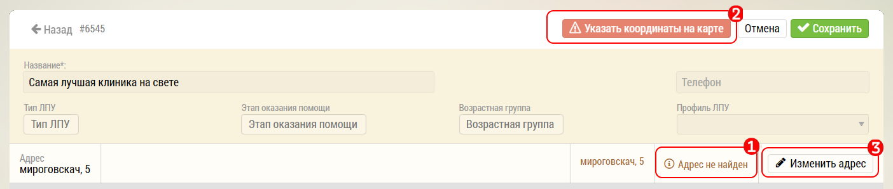
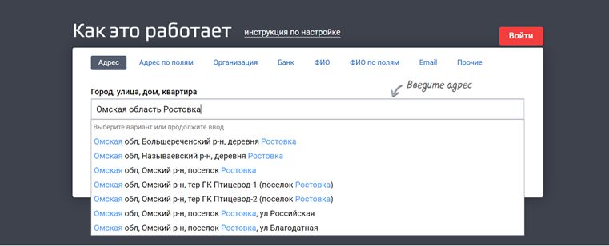
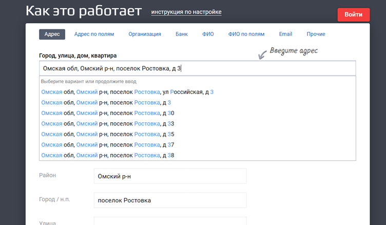

# Нет геоверификации визита

1. Убедитесь что на Вашем устройстве включена геолокация
2. Включите в строке браузера разрешение на передачу геоданных

После загрузки система запрашивает данные о местоположении.

В зависимости от браузера, настроек геолокации и протокола сайта окно может выглядеть иначе или его может не быть вовсе.

Нужно разрешить программе доступ к данным о местоположении.

Вне зависимости от ответа разрешение можно изменить или отменить в любой момент.

3. Убедитесь, что объект (клиника или аптека) имеют правильный, геоверифицированный адрес.

* Об этом сигнализирует надпись `1`

* У клиники есть метка с координатами `2`.

В случае если клиника не распознана:

`1` Программа уведомляет, что адрес не найден

`2` Отсутствуют координаты объекта (можно указать вручную)

Для того что бы распознать адрес нажмите на `3` - Изменить адрес, далее:
 
1. Определите с помощью Я.Карт https://yandex.ru/maps что объект существует, сравните адреса.
2. Измените адрес на правильный , программа выдаст что адрес подтвержден, появится значок геолокации с координатами

 
3. Проверьте что адрес на карте в программе Медпред соответствует той точке, где вы находитесь, для этого нажмите на значок геолокации.

**Если адрес не подтверждается**

1. Перейдите на https://dadata.ru/suggestions/#address, скопируйте и вставьте адрес в строку поиска:

2. Начните по-порядку набирать сначала улицу, потом дом, строение – выбирайте из списка предложенных

3. Скопируйте адрес в программу, сохраните
4. Проверьте что адрес на карте в программе Медпред соответствует той точке, где фактически должен быть

> Адрес будет соответствовать ФИАСу

> Иногда программа может не распознавать корпуса и строения по заданному адресу объекта, в этом случае сохраните адрес с точностью до дома, и вручную измените геометку на карте, разместив ее на нужном строении.
