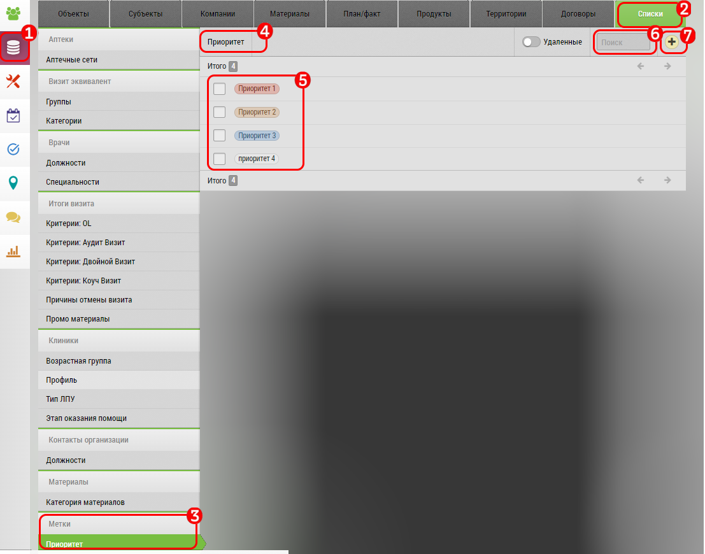
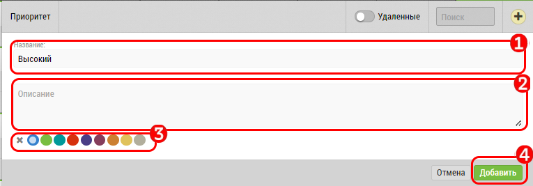
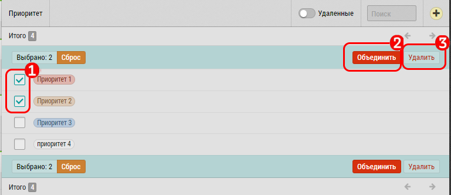

# Работа с метками

>`Администратор`

Редактирование "Меток" происходит в интерфейсе "[Списки](database-dict.html)". 

Метки помогают отмечать объекты и субъекты, и в дальнейшем получать отчеты по выбранной метке

> Для первоначального создания категорий меток нужно обратиться с запросом в Техподдержку

Когда категории меток будут загружены - далее Вы можете редактировать их самостоятельно:

Для управления метками перейдите на вкладку «База данных» `1` 

Выберите вкладку «Списки» `2`

Из названий групп выберите Метки `3` 

Откроется категория меток для редактирования, содержащая название категории `4` и состоящая из меток `5`

`6` Поиск по названию

`7` Добавить новую метку

## Добавление новой метки

Наберите название метки `1`

Описание метки `2`

Выбор цвета метки `3`

Добавить `4`
 
 ## Удаление и объединение меток

 

Для удаления или объединения меток отметьте нужные метки `1`

Выберите действие "Объединить" `2`

Удалите метки  `3`
