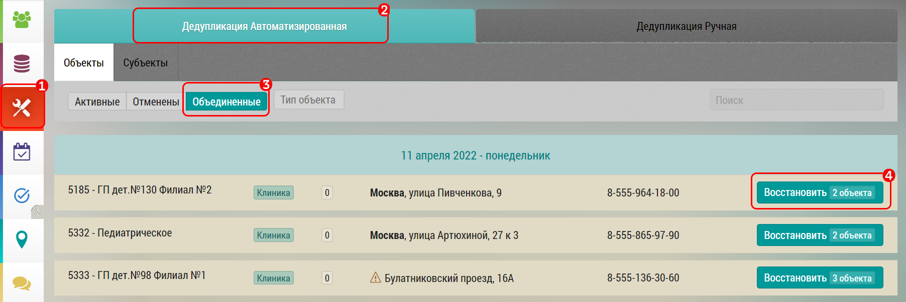

# Восстановление результатов объединения

Чтобы отменить результаты объединения необходимо:

- перейти в окно восстановления результатов объединения `1`, `2`, `3`
- найти нужный объект/субъект
- нажать кнопку "Восстановить 2 объекта" `4`

- появится надпись "Обрабатывается записей: 1..." после чего объединение будет отменено
