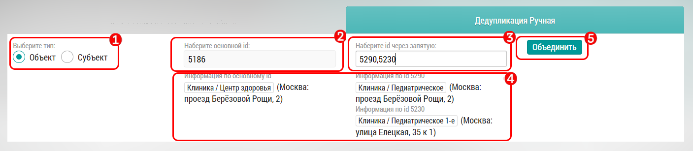

# Ручная Дедупликация

Модуль ручной дедупликации позволяет объединять дубли объектов и субъектов (врачей), по какой-то причине отсутствующих в модуле атоматической дедупликации. 

Для того что бы объединить дубли в ручном режиме, найдите ID объектов или субъектов, которые планируете объединить:

1. Выберите тип данных для объединения
2. Заполните основной ID, который будет главным после объединения дублей
3. Наберите ID объектов через запятую
4. Проверьте информацию об объектах для объединения
5. Нажмите кнопку объединить

> Перед ручной дедупликацией проверьте правильность объединяемых объектов, 
> так как на текущий момент отменить ручную дедупликацию нельзя
