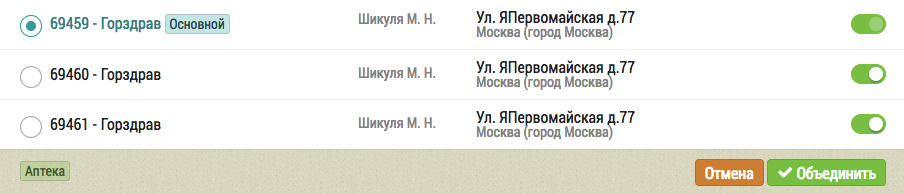

## Объединение дублей

Найденные дубли объектов выделены в отдельные группы в которых указана вся необходимая информация: Название объекта, кто добавил в базу, адрес и телефон.

Так же помечен основной объект, данные которого имеют больший приоритет при объединении. 
Используя переключатели слева можно выбрать другой основной объект.

Если какой-то из объектов не нужно объединять, следует убрать его из группы нажав на переключатель справа:

Для объединения выбранных объектов следует нажать на кнопку "Объединить", после чего начнется процесс слияния:

По завершению которого появится всплывающее окно.

Если все объекты в группе уникальны и не требуют объединения, то следует нажать на кнопку "Отмена".
