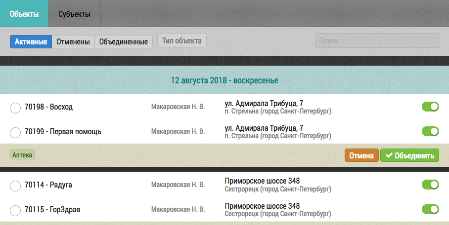

## Дедубликация

Модуль дедубликации позволяет находить и объединять дубли объектов и субъектов (врачей). 
Поиск дублей осуществляется автоматически с периодичностью раз в неделю.

Найденные дубли выводятся в виде групп в соответствующих вкладках:

- [Объединение дублей](tools-deduplication-merge.md)
- [Восстановление результатов объединения](tools-deduplication-cancel.md)
